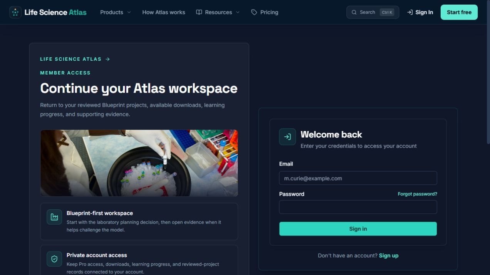
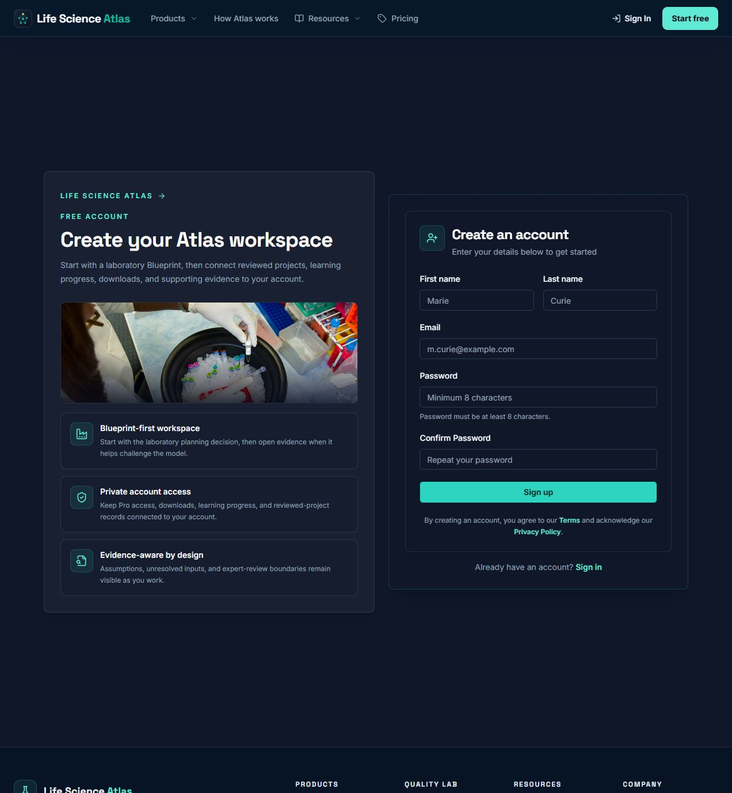
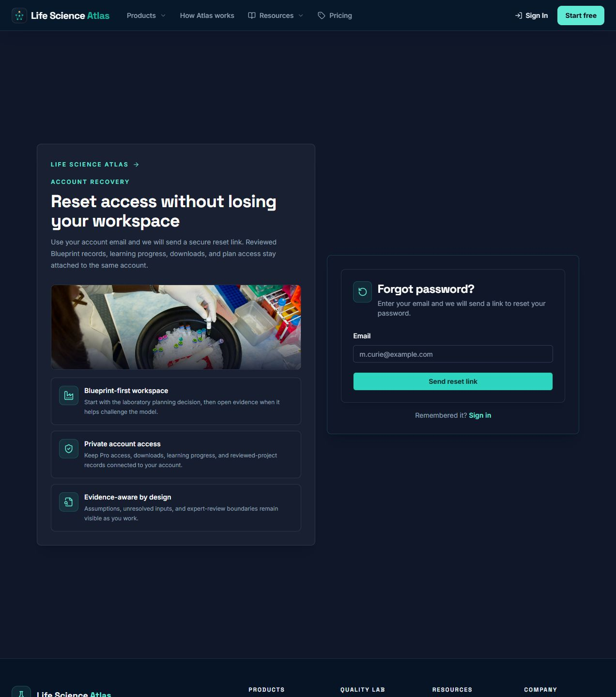
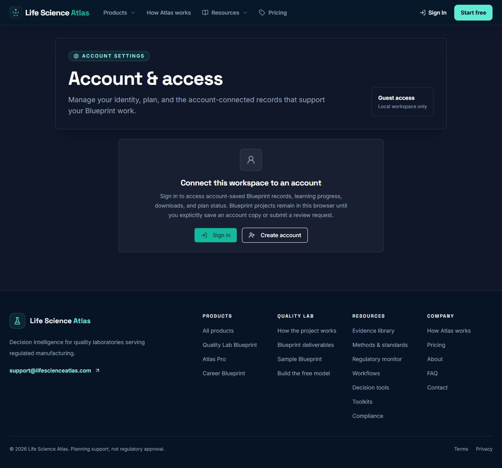
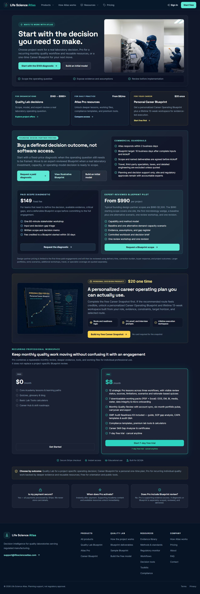
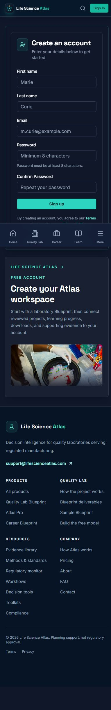
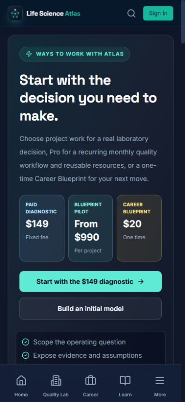

# Account and Conversion UX Audit — 2026-08-24

## Audit scope

Combined UX and accessibility audit of the public account and conversion path:

1. Sign in with a protected return destination.
2. Create an account while preserving the originating task.
3. Recover an account and handle an incomplete reset link.
4. Open Settings as a guest.
5. Compare product offers and start a Pro checkout as a guest.
6. Reflow the account and pricing entry surfaces at 390 × 844 CSS pixels.

The audit used the local application in the Codex in-app browser. No account was created, no personal data was entered, and no checkout or external communication was submitted.

## Evidence and step health

### 1. Sign in — healthy after fix

- The page keeps Blueprint work, downloads, and evidence as the reason to sign in.
- The registration link preserves the requested return destination.
- Email and current-password fields now expose names and standards-based autocomplete tokens.

### 2. Create account — healthy after fix

- The form is concise and the page explains what the account connects.
- Given name, family name, email, and new-password fields now expose appropriate autofill metadata.
- The submit area now links the user directly to Terms and Privacy Policy.

### 3. Account recovery — healthy

- The recovery promise is clear and does not imply workspace loss.
- The response remains enumeration-safe in the implementation.
- The email field already supports email autofill and the success state is announced through an `aria-live` region.

### 4. Incomplete reset link — healthy

- The error is specific, non-technical, and offers a direct recovery action.
- The page does not render unusable password fields without a token.

### 5. Guest Settings — healthy

- Guest/local-only status is explicit.
- Sign-in and account-creation actions preserve `/settings` as the destination.
- The copy clearly distinguishes browser-local Blueprint projects from explicitly saved account copies.

### 6. Product comparison and Pro conversion — healthy after fix

- Project work, recurring Pro access, and the one-time Career product are visibly distinct.
- Prices and commercial boundaries match the Product Source of Truth.
- Starting Pro checkout as a guest now preserves the exact selected plan through registration and sign-in, then resumes checkout once authentication completes.

### 7. Mobile registration — healthy after fix

- The form appears before supporting marketing content at 390 × 844, which prioritizes task completion.
- No horizontal overflow was detected.
- The fixed mobile navigation overlaps the viewport edge but does not prevent the form, legal links, or footer from being reached by scrolling.

### 8. Mobile pricing entry — healthy

- The three product choices and headline prices are visible before the first viewport ends.
- The primary Diagnostic action remains dominant, consistent with the service-assisted flagship strategy.
- No horizontal overflow was detected.

## Resolved findings

1. **High — Pro intent was lost at authentication.** The guest Pro CTA previously navigated to bare `/register`, whose default completion destination is `/welcome`. It now carries a validated internal return target with the selected plan and resumes the checkout request after authentication.
2. **Medium — Account forms did not identify autofill purpose.** Login and registration fields now use `name`, `autocomplete`, and email input-mode attributes appropriate to their purpose.
3. **Medium — Registration lacked nearby legal context.** The submit area now exposes Terms and Privacy Policy links without adding a mandatory marketing opt-in or dark pattern.

## Accessibility evidence and limits

- Confirmed from rendered DOM: visible labels, required fields, semantic headings, explicit autocomplete tokens, live recovery status, named links/buttons, and no 390-pixel horizontal overflow.
- Confirmed from browser logs: no console errors during the audited routes and interactions.
- Not claimed: formal WCAG conformance, screen-reader behavior across platforms, real password-manager behavior, email delivery, authenticated checkout completion, or payment success. Those require assistive-technology testing and configured external services.
