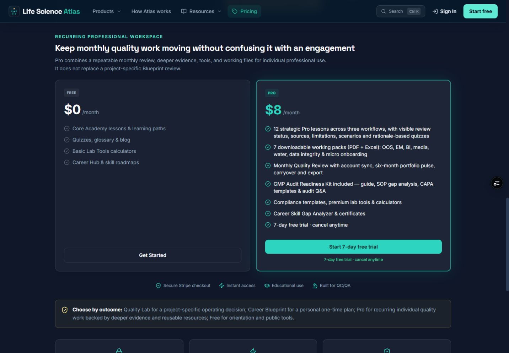
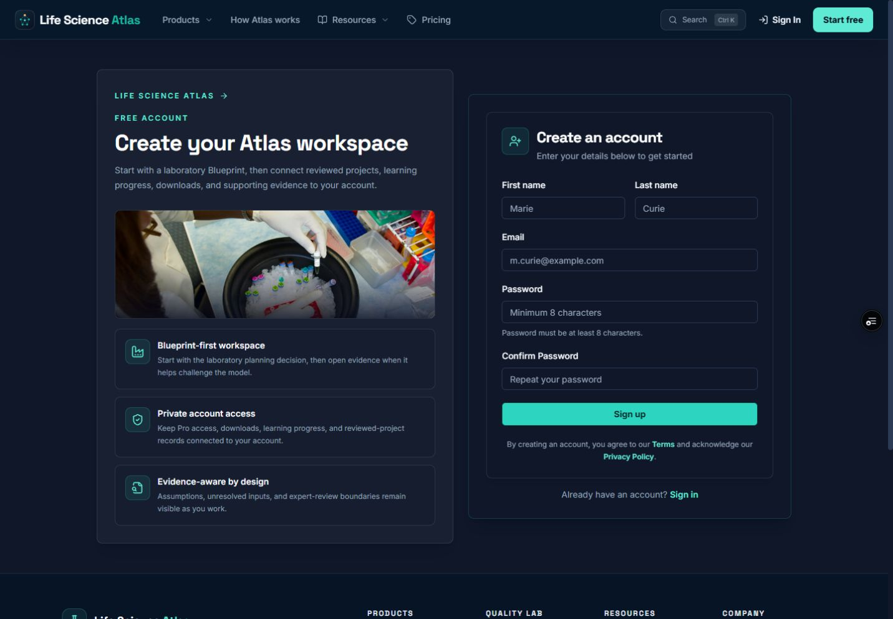
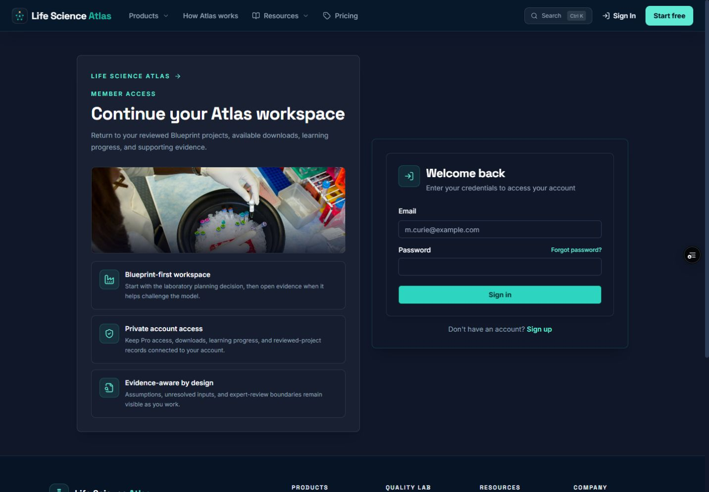
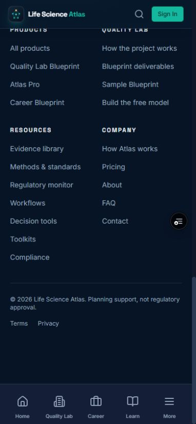
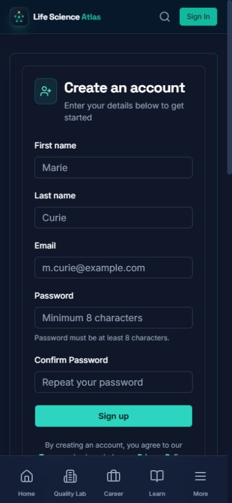
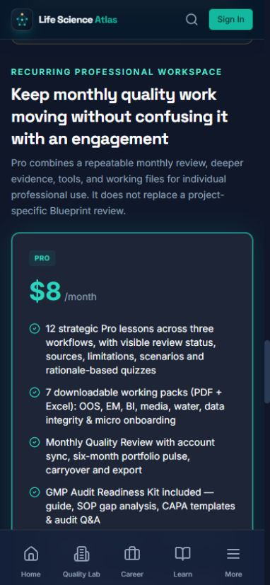

# Account handoff UX audit — 25 August 2026

## Audit scope

Focused review of the guest Pro path on PR #9:

`Pricing → Start Pro trial → create account → switch to sign in → return to selected plan`

The deployed preview was inspected first at 1440 × 1000 and 390 × 844 CSS pixels. The corrected states were then inspected against the local implementation in the same Chrome session and viewports. No form was submitted, no account was created, and no checkout or external communication was started.

## Numbered flow

1. **Desktop Pro comparison — healthy.** The recurring workspace is clearly separated from Free, the trial term is adjacent to the CTA, and project-specific work is not confused with the subscription.

   

2. **Desktop registration handoff — healthy.** The guest CTA carries the selected `pro_subscription` return target into registration. The form appears alongside a concise explanation of what the Atlas account connects.

   

3. **Desktop account switch — healthy.** “Sign in” preserves the same encoded pricing and checkout destination instead of falling back to a generic account landing page.

   

4. **Mobile registration handoff — defect reproduced.** Before the fix, route navigation retained the long Pricing-page scroll position. Registration opened near the footer, leaving the form outside the viewport even though the URL was correct.

   

5. **Mobile registration handoff — fixed.** Ordinary cross-route navigation now resets to the top. The account form is immediately visible, and the header Sign In action preserves the selected checkout destination as well as the in-form link.

   

6. **Mobile deep link — fixed and reprioritized.** A direct `#evidence-plans` URL now settles below the sticky header after the lazy route renders. Pro precedes Free on the single-column mobile layout, so a Start Pro handoff no longer makes the user traverse the Free card first.

   

7. **Desktop deep link — unchanged and healthy.** The same anchor lands at the comparison heading while preserving the established side-by-side Free/Pro order.

   

## Resolved findings

1. **High — cross-route navigation retained stale scroll.** A mobile user could reach registration at the footer after pressing the trial CTA. The shared route-scroll manager now resets ordinary routes and waits for lazy-rendered hash targets before scrolling.
2. **Medium — mobile plan order worked against Pro intent.** The linked comparison showed the Free card before Pro in a single column. CSS ordering now makes Pro first on mobile while keeping the desktop comparison unchanged.
3. **Medium — the header account switch could discard checkout intent.** The prominent guest Sign In action on registration used a generic `/login` destination. Desktop and mobile headers now preserve a validated internal `returnTo` when switching from registration.
4. **Low — an account-entry test used an ambiguous Password label.** The assertion now selects the exact password field rather than also matching Confirm Password.

## Strengths

- Product and price boundaries remain consistent with the Product Source of Truth.
- Registration and sign-in keep the Blueprint-first account explanation rather than presenting authentication without context.
- The selected plan survives both registration and sign-in routes without exposing an unsafe external redirect.
- Desktop hierarchy was preserved while the mobile sequence became more task-directed.

## Accessibility evidence and limits

- Confirmed from the rendered flow: named controls, visible form labels, standards-based autocomplete metadata, no document-level horizontal overflow in the audited mobile states, and stable content below the sticky header/navigation.
- Regression coverage checks the mobile post-click scroll position, the preserved header return link, deep-link alignment, and the visual order of Pro before Free.
- Not claimed: formal WCAG conformance, screen-reader behavior across platforms, browser/password-manager autofill behavior, authenticated checkout completion, payment processing, or post-payment entitlement. Those require human assistive-technology review and configured production services.

