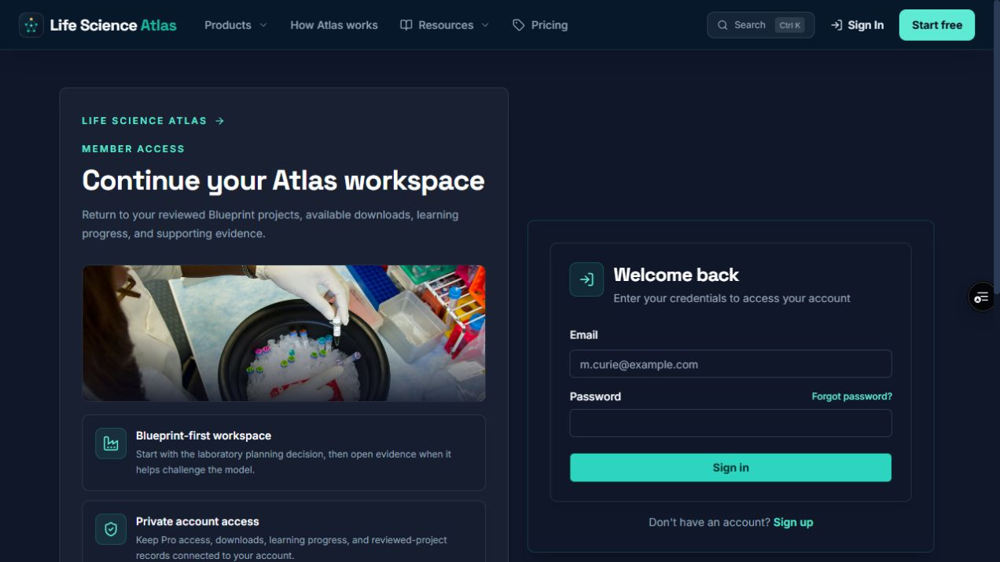
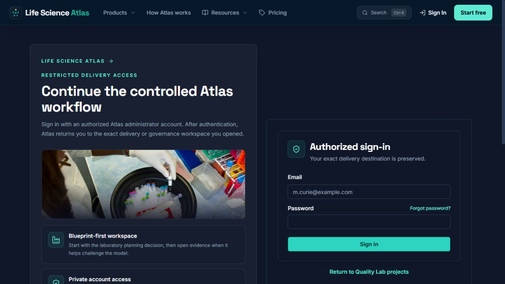
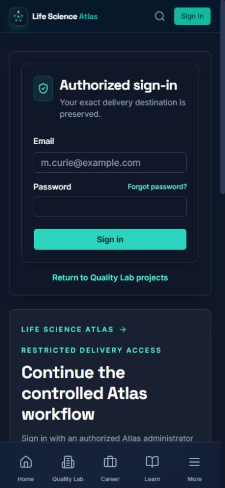

# Admin delivery return-path UX audit

Date: 2026-08-25

## Audit scope

Combined UX and accessibility review of the Gate 1 operational handoff:

`Engagement / governance deep link → restricted sign-in → exact workspace return`

The guest state was captured in the deployed PR preview before the fix and in the local implementation after the fix. The authenticated return was verified through a mocked-admin browser journey; no production account, customer record or delivery evidence was changed.

## User goal and accessibility target

An authorized Atlas delivery owner should be able to open a specific engagement, paid-pilot, calibration or governance link, authenticate, and resume the exact record and section without reconstructing context. An unauthorized visitor should understand that the surface is restricted and should not be invited into a sign-up path that cannot grant access.

## Numbered flow

1. **Open a restricted engagement deep link — broken before the fix.** Every admin-only Quality Lab route was rewritten to `/login?next=/admin`, discarding the engagement ID, query string and section hash. The login page did not explain that the requested delivery record had been lost.

   

2. **Understand the authentication boundary — healthy after the fix.** The sign-in URL now carries the complete internal destination. Desktop copy identifies restricted delivery access, states that the exact destination is preserved, and replaces the misleading sign-up prompt with a safe return to Quality Lab projects.

   

3. **Use the same handoff on mobile — healthy after the fix.** The first mobile viewport labels the form `Authorized sign-in`, confirms destination preservation, keeps the sign-in action visible, and exposes the project exit above the secondary context card. The layout has no observed horizontal clipping at 390 × 844 CSS pixels.

   

4. **Return after authentication — healthy in deterministic browser coverage.** A mocked authorized admin now returns to the exact engagement ID and `#pilot-evidence` section. Non-admin users still fail closed to the normal Projects workspace. The same return contract covers the paid-pilot, calibration, source, ownership, validation, release, governance and rule-change controls.

## Strengths

- The authorization boundary remains fail-closed; the change preserves navigation context without widening access.
- Existing member sign-in and registration handoffs keep their current Blueprint-first behavior.
- Legacy internal `next` links remain supported during migration, while absolute, protocol-relative, backslash and control-character redirects are rejected.
- The restricted state now has a clear recovery path instead of suggesting that a new public account can access administrative delivery controls.

## UX and accessibility risks resolved

- Delivery owners no longer land on the general Admin dashboard after authenticating from a specific engagement.
- Engagement IDs, query parameters and section hashes are preserved together.
- Mobile users see the authorization purpose and preserved-destination message in the form card before scrolling.
- The form retains explicit email/password labels, autocomplete metadata, a visible submit action and a standard internal-link fallback.

## Evidence limits

- No production admin credentials were used. The post-authenticated state is covered by the repository browser test with a mocked admin session, not by a live account screenshot.
- Screenshots and automated checks do not establish full WCAG conformance; screen-reader phrasing, zoom, speech input and assistive-technology behavior still require human review for a formal claim.
- This slice does not create reviewer appointments, payment evidence, client acceptance or any other Gate 1 real-world evidence.
