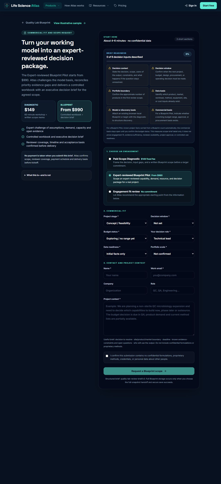
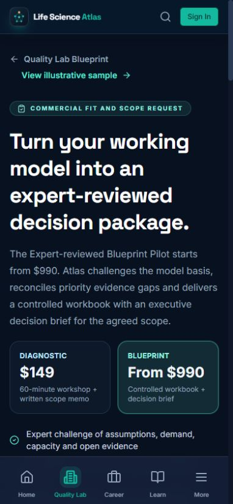
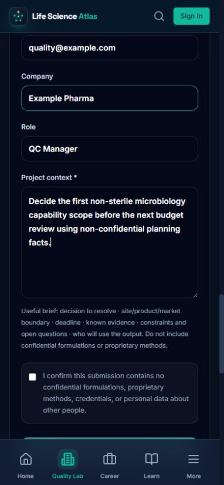
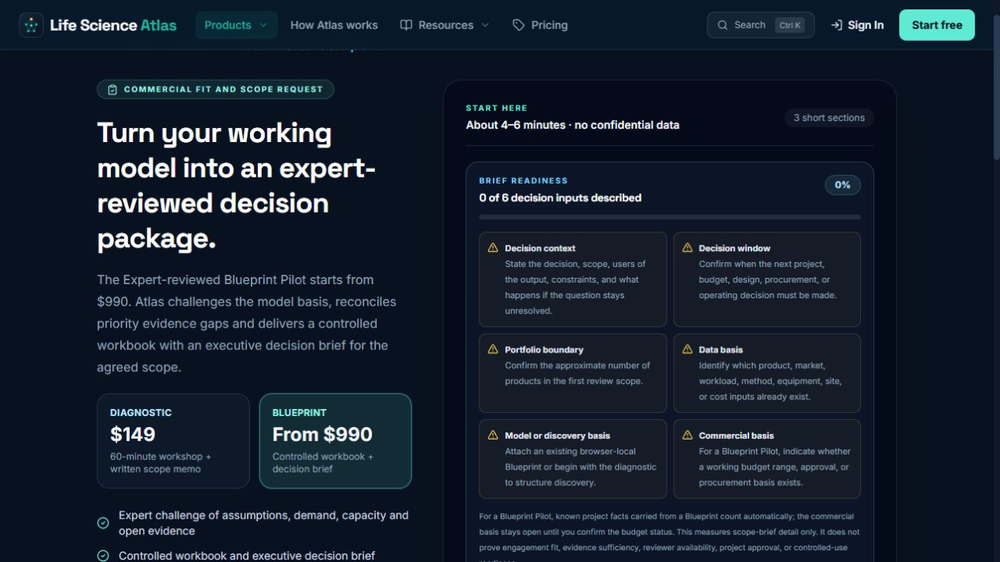

# Commercial request resilience UX audit — 2026-08-27

## Audit scope

Combined UX and accessibility review of the public Quality Lab commercial-request path at `/quality-lab/review?offer=blueprint`, focused on interruption, acknowledgement, duplicate-submission risk and the operator queue boundary.

## User goal and accessibility target

A prospective buyer should be able to understand the offer, prepare a non-confidential scope brief, submit it once, retain a trustworthy receipt through an ordinary reload and identify the same request reference in the acknowledgement email. The path should remain readable and operable at desktop and 390 × 844 mobile widths.

## Flow steps and health

1. **Understand the offer and start the brief — healthy.** The Blueprint value, starting price, commercial boundary and three-part form are visible before contact fields. Desktop hierarchy is clear and mobile reflows without horizontal overflow.
2. **Prepare the scope brief — needs caution.** The readiness panel makes missing decision inputs explicit, but an unfinished brief is intentionally not persisted because it may contain contact and project context. Reloading or leaving before submission clears it.
3. **Submit and retain acknowledgement — fixed.** A successful request now creates a privacy-minimal, 24-hour browser-tab receipt scoped to the standalone intake or exact Blueprint project. The success page displays the database request reference and reload restores the acknowledgement without issuing a second POST.
4. **Protect the operator queue — improved.** Both public quote and Quality Lab review endpoints now share a bounded request limiter. An actionable server message is surfaced by the review mutation instead of a generic failure.

## Captured evidence

### 1. Desktop entry and full brief

Strengths: the offer precedes data collection; prices, exclusions and review boundaries are prominent; all controls have visible labels.

Risk: the form is intentionally dense because it gathers six commercial-fit dimensions plus project context. The readiness panel helps explain why each input matters, but this is still a high-attention task.

### 2. Mobile entry

Strengths: the promise, pricing and deliverable basis are understandable before the form; no horizontal overflow was observed at 390 × 844.

Risk: the persistent bottom navigation makes accidental departure possible while the form is incomplete. The app does not store unfinished contact or context fields.

### 3. Interrupted mobile brief

Observed behavior: reloading returned the contact fields, project context, decision window and portfolio scale to their defaults. This run treats that as an explicit privacy trade-off rather than silently adding pre-submission persistence. The completed-request receipt addresses the higher-risk duplicate-submission case after the server has accepted the brief.

### 4. Desktop regression check after implementation

The offer hierarchy and form entry remained intact after the receipt and endpoint changes. No horizontal overflow, console error or console warning was observed in this state.

## UX and trust improvements implemented

- The submission receipt is versioned, expires after 24 hours and carries only offer, scope key, numeric request reference and timestamp—never name, email, company or project context.
- Project receipts do not leak across different browser-local Blueprint IDs.
- Legacy Diagnostic receipts still support the existing register/sign-in return path without inventing a missing reference.
- The confirmation uses the submitted offer rather than whatever default the route would reconstruct after reload.
- The confidentiality acknowledgement is passed as the actual checked state and submission exits early if it is false.
- Public commercial requests are throttled before database write or email fan-out.

## Accessibility risks and evidence limits

- The captured form has labelled native controls, a semantic progressbar, visible required markers, a large full-width submit action and mobile reflow without horizontal overflow.
- The completed receipt adds `role="status"`, but the success state could not be captured locally because the development database is intentionally unavailable. Its DOM and reload behavior are covered by the critical browser regression test with a mocked 201 response.
- Screenshots do not prove screen-reader announcement order, keyboard-only behavior, browser zoom resilience, contrast ratios or reduced-motion behavior. Those require runtime accessibility checks.
- The in-memory limiter is per application instance. It reduces opportunistic abuse but is not a distributed anti-abuse or identity-deduplication system.

## Remaining opportunity

If field evidence shows significant pre-submission abandonment, add an explicit user-controlled “keep this draft in this tab” option rather than silently persisting contact and project context. Gate 1 still requires real engagement evidence before that trade-off can be prioritized from observed behavior.
