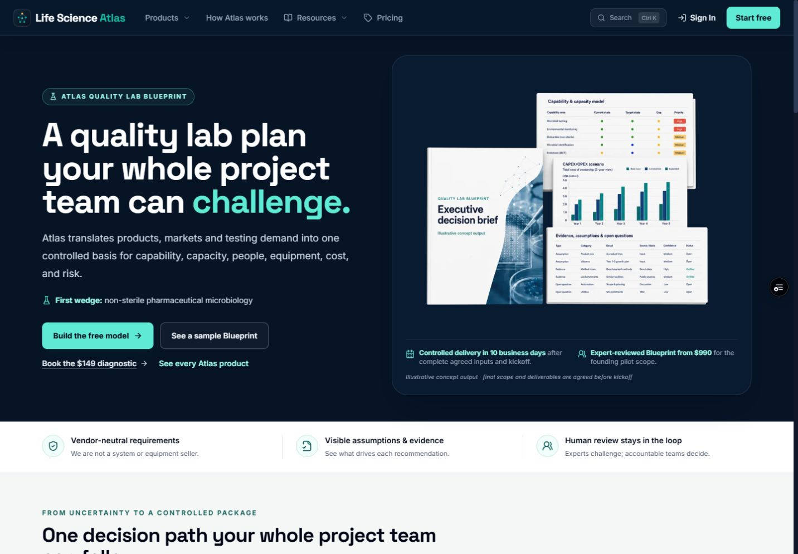
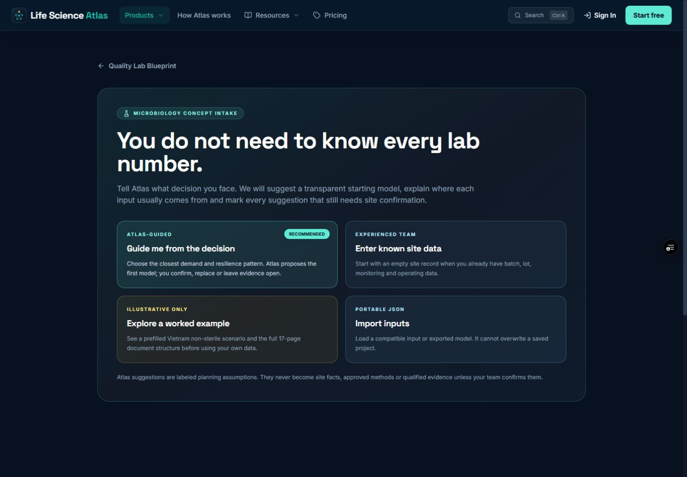
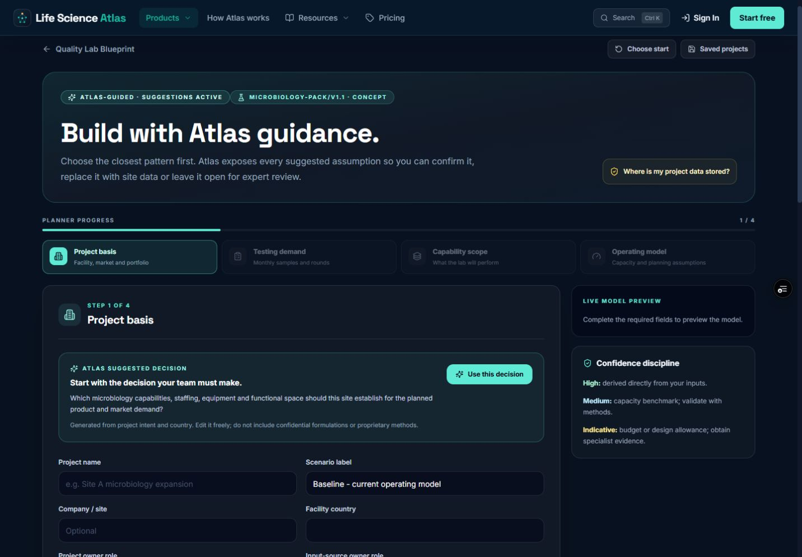
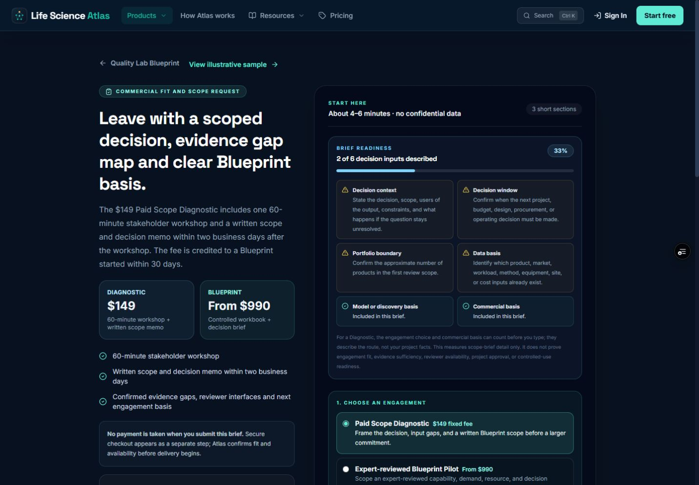
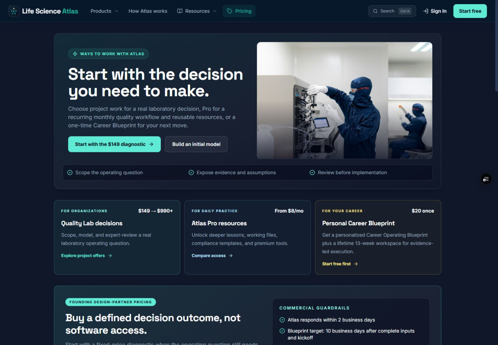
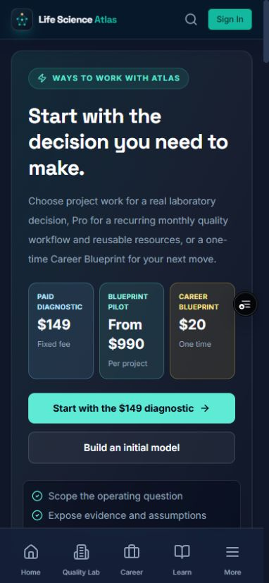
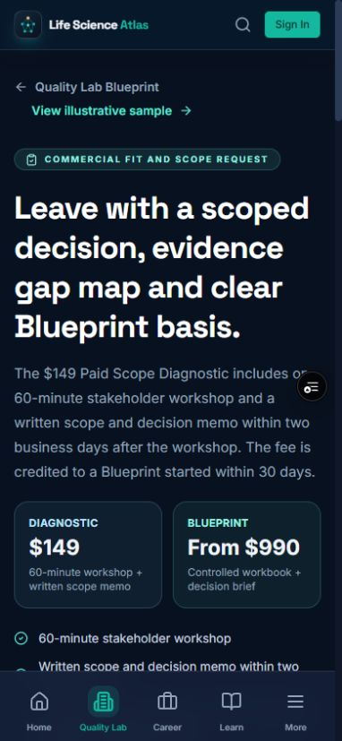
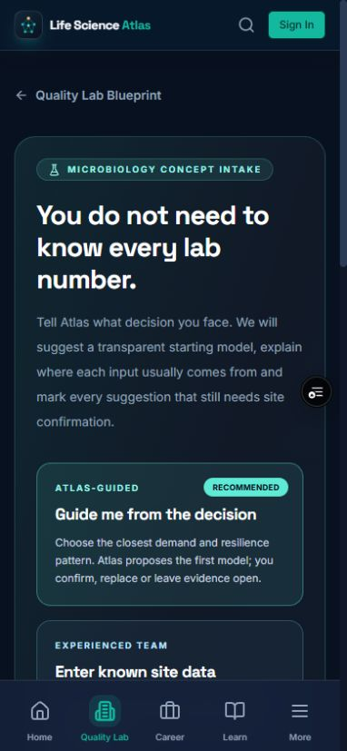
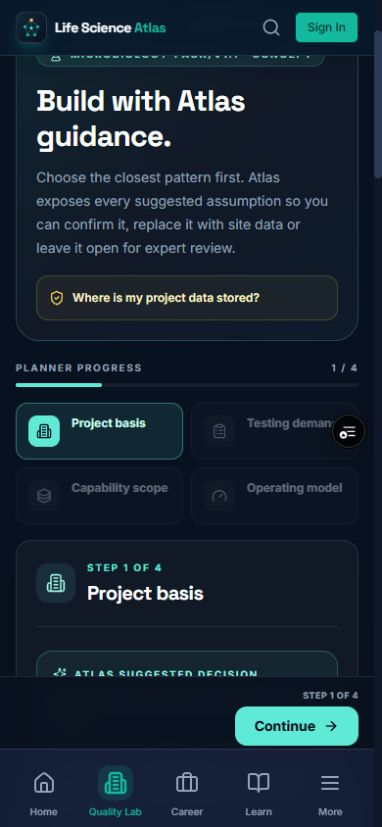
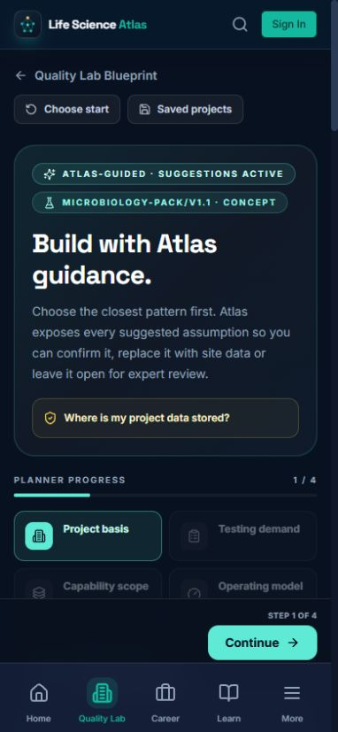

# Completion UX audit — 25 August 2026

## Audit scope

Combined UX and accessibility review of the public flagship path on PR #9:

`Homepage → free Quality Lab model → guided intake → Paid Scope Diagnostic → pricing`

The preview was inspected at 1440 × 1000 and 390 × 844 CSS pixels. The final planner transition was verified against the local implementation after the fix. Screenshots that still showed a loading state were rejected and recaptured after the route was visually stable.

## User goal and accessibility target

A guest should understand the flagship offer, choose the appropriate commercial route, start a model, and enter the guided planner without losing context. The reviewed controls should remain readable, keyboard-operable, semantically named, and free of document-level horizontal overflow.

## Numbered flow

1. **Homepage — healthy.** The Quality Lab offer, first wedge, free model, sample and Diagnostic are visible in the first desktop viewport. The flagship remains clearly ahead of supporting products.

   

2. **Planner entry choice — healthy.** The guided, blank, example and import routes are distinct, and the assumption boundary is visible before data entry.

   

3. **Guided intake on desktop — healthy.** Progress, locked-step reasons, the suggested decision, confidence discipline and the first controlled inputs are visible without confusing suggestions with site facts.

   

4. **Paid Scope Diagnostic on desktop — healthy.** Price, deliverable, timing, checkout boundary, readiness gaps and engagement choices are visible before contact fields.

   

5. **Pricing on desktop — healthy.** Project work, Pro and Career remain separated by buyer outcome; the flagship CTA and founding price basis have the strongest hierarchy.

   

6. **Pricing on mobile — healthy.** The three routes and their price bases remain comparable in the first viewport, followed by the two primary project actions.

   

7. **Diagnostic on mobile — healthy.** Offer, price, credit, delivery expectation and review boundary remain readable before the form. The sticky product navigation does not cover the active content.

   

8. **Planner entry on mobile — healthy.** The recommended guided route leads the stack and the evidence boundary remains visible before the secondary choices.

   

9. **Guided transition on mobile — fixed.** The preview retained the click-induced scroll position when the entry cards were replaced with the form. This hid the route controls and the beginning of the new screen. The transition now resets to the top and moves programmatic focus to the new H1.

   **Before**

   

   **After**

   

## Strengths

- The flagship decision journey is discoverable from the homepage, pricing and mobile navigation.
- Commercial copy distinguishes free orientation, the $149 Diagnostic and the $990+ Blueprint without implying payment or review before fit confirmation.
- Planner guidance labels assumptions, provenance boundaries and locked-step reasons clearly.
- Desktop and mobile layouts preserve a consistent hierarchy without document-level horizontal overflow.

## Finding resolved

### Planner mode change retained stale mobile scroll position

Selecting a start mode changes the page from a choice screen into a new four-step workflow. Because the clicked card had been scrolled into view, the replacement workflow inherited that scroll position. The new screen now calls `window.scrollTo({ top: 0 })`, assigns focus to the H1 with `preventScroll`, and exposes a visible focus treatment for keyboard users. Regression coverage asserts the focused heading, `scrollY === 0`, and immediate visibility of `Choose start` and `Saved projects` at 390 × 844.

## Evidence limits

- The black circular control visible in some preview screenshots is Vercel's injected `vercel-live-feedback` element, not application UI and not present on a normal production response.
- Automated axe checks and screenshots do not establish full WCAG conformance. A human screen-reader, zoom, speech-input and touch-target review is still required for a formal claim.
- The request form was not submitted during this audit, so no contact data, email, checkout or external side effect was created. Those paths remain covered by automated journey tests and require the documented production acceptance run after configuration is ready.
