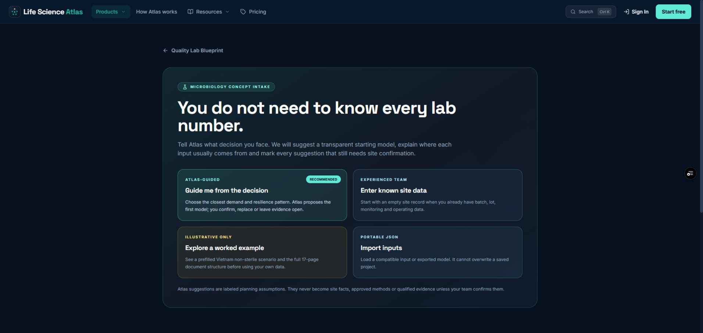
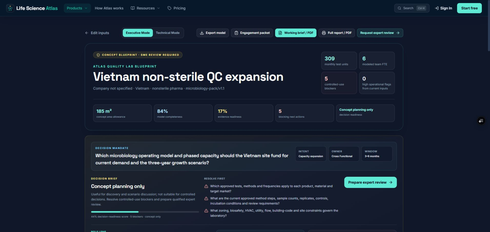
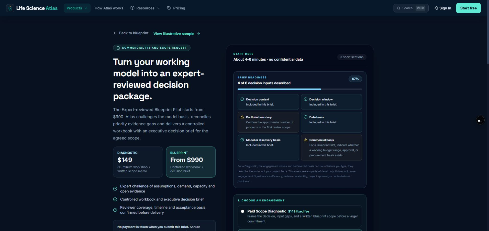
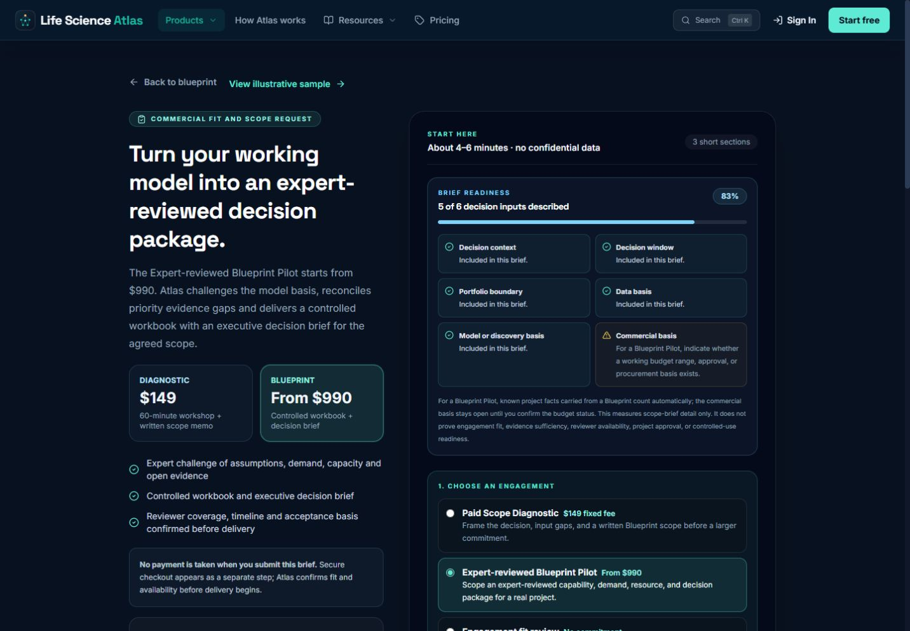
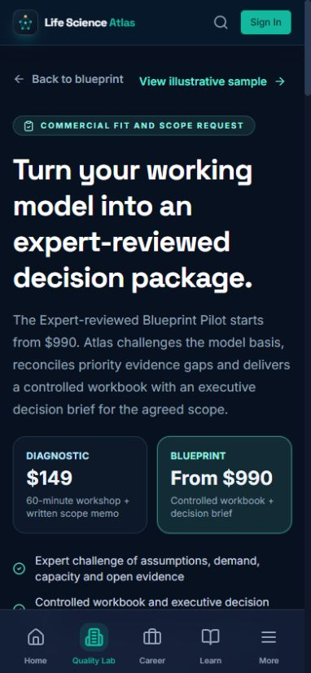
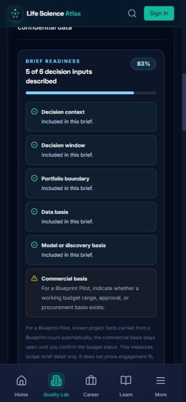

# Gate 1 Blueprint-to-brief context UX audit — 2026-08-25

## Scope and health

Audited the worked-example path from Blueprint intake through the compiled report and into the Expert-reviewed Blueprint Pilot brief. Baseline evidence came from the current Vercel preview; the corrected state came from the verified local build. No brief was submitted, no checkout was opened, and no external customer or lead record was created.

A transient blank Preview load was rejected as evidence. A cache-busted navigation rendered the same deployed build normally, and the stable product states below were captured only after the page had completed rendering.

## Numbered flow

1. Choose a Blueprint start mode

   

   **Health:** Good. Guided, known-data, illustrative, and portable-input paths are differentiated and the example is explicitly bounded.

2. Compile a working Blueprint

   

   **Health:** Good. The first viewport exposes the decision mandate, modeled scope, readiness, blockers, exports, and expert-review action.

3. Open the contextual commercial brief — baseline

   

   **Health:** Needs correction. The Blueprint contained 40 finished products and 80 raw materials, but the commercial brief reset Portfolio scale to `Not confirmed`. The readiness control therefore reported 4/6 and asked the user to confirm a known project fact. Its explanatory text also described Diagnostic behavior while the Blueprint Pilot was selected.

4. Reopen the corrected contextual brief

   

   **Health:** Good. Forty finished products now maps deterministically to `Over 25 products`; the exact product and raw-material counts are inserted into Project context; readiness increases to 5/6; and only the genuinely unknown commercial basis remains open. Offer-specific guidance explains why.

5. Verify mobile entry and readiness

   

   

   **Health:** Good. The 390 × 844 layout has no document-level horizontal overflow. The carried portfolio boundary, 5/6 status, 83% progress value, and remaining commercial-basis action remain legible.

## Strengths retained

- Known Blueprint facts are reused without treating them as approved evidence.
- The user can still change the derived portfolio band before submission.
- Budget status remains open rather than being inferred from project intent or model completeness.
- Readiness remains explicitly a scope-brief-detail measure, not proof of fit, approval, evidence sufficiency, reviewer availability, or controlled-use readiness.

## Accessibility and evidence limits

- The portfolio band is exposed through the existing labelled native select; the progress value remains available through its `aria-valuenow` attribute.
- Automated interaction verifies the derived select value, project-context text, progress value, and offer-specific guidance.
- Automated WCAG 2.1 A/AA scans pass for the commercial-review route at desktop and 390 × 844 mobile viewports, and the route passes the dedicated 320 px reflow check without horizontal document overflow.
- Three serious small-text contrast failures found during this audit were corrected before the final screenshots and verification run.
- Screenshot review cannot establish full screen-reader clarity, keyboard-only traversal, high-contrast behavior, zoom resilience, or real-device assistive-technology support.
- Production submission, payment, email delivery, and database persistence remain outside this audit because those actions create external state and require owner-controlled production readiness.
