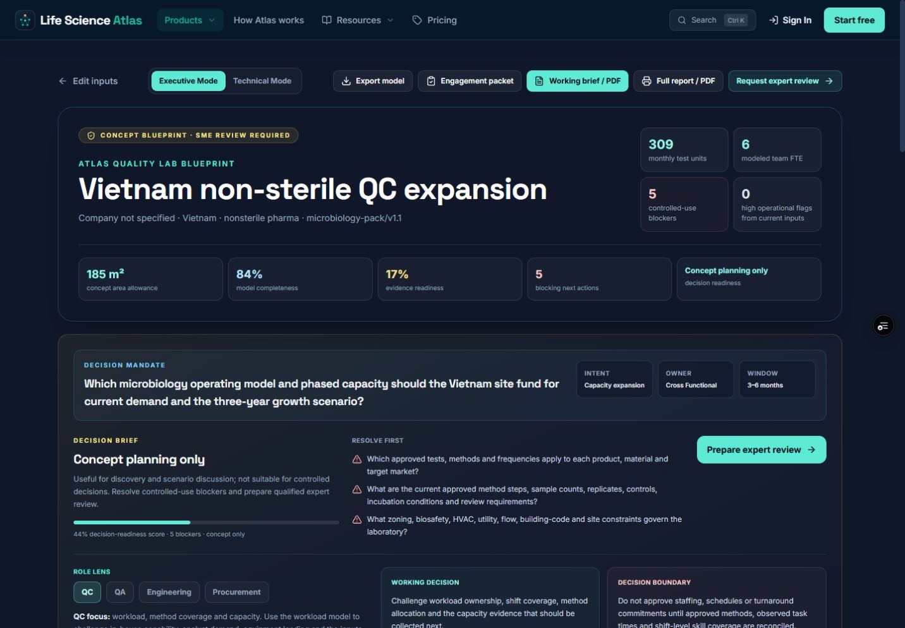
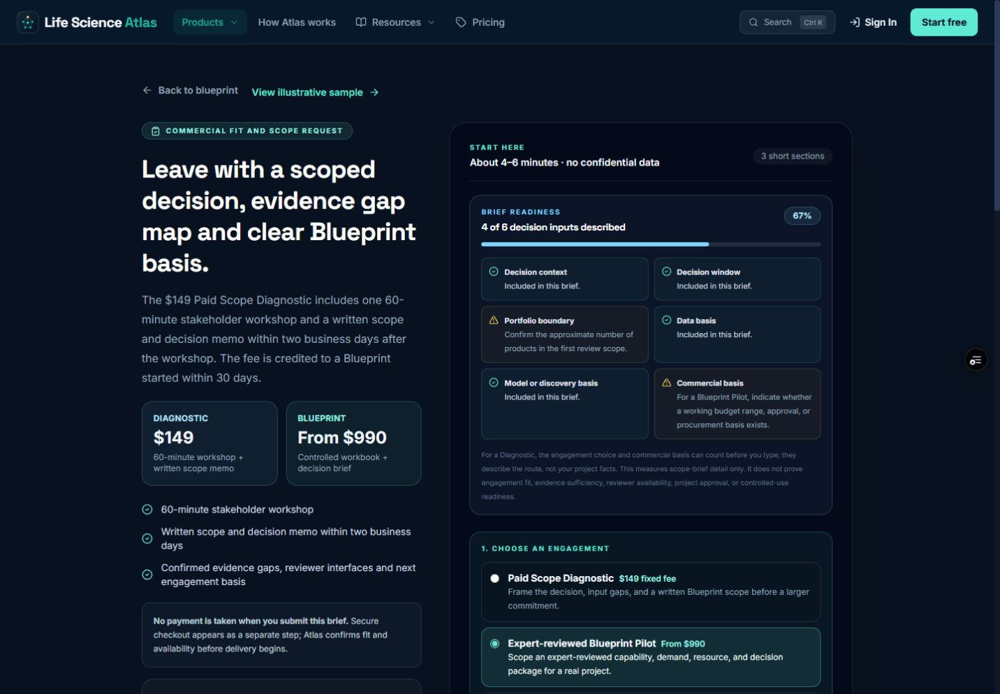
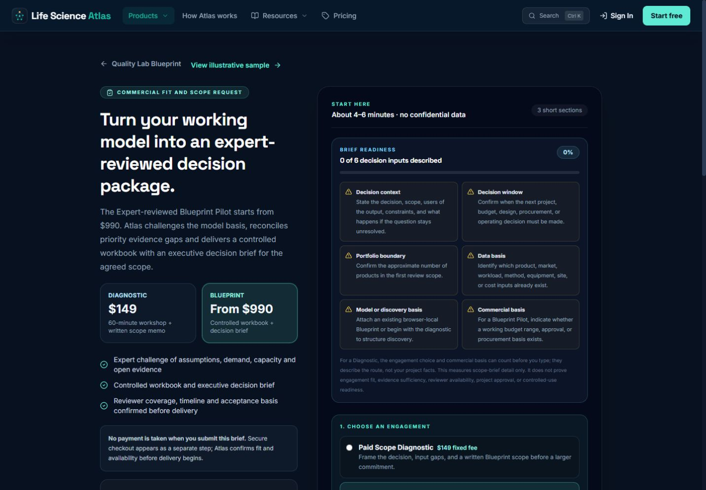
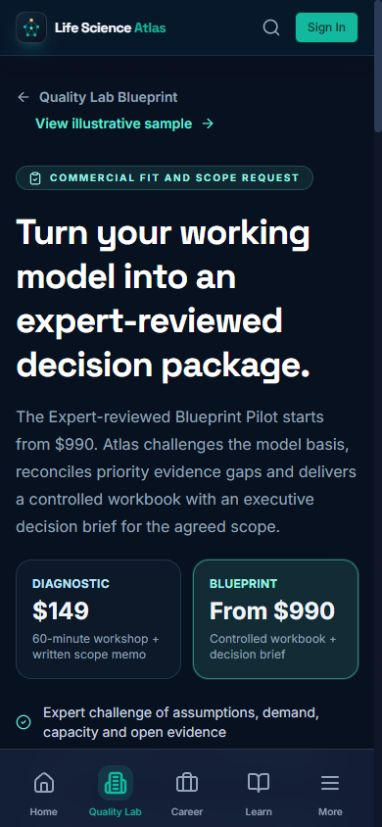

# Gate 1 commercial handoff UX audit — 2026-08-25

## Scope and health

Audited the public Quality Lab path from the free model through the generated Blueprint and into the commercial expert-review brief. The audit used the current Vercel preview for the baseline and a local verified build for the correction. No scope brief was submitted, no checkout was opened, and no lead or customer record was created.

The audited UI rendered without console errors, broken navigation, horizontal overflow, or loading-state artifacts. Production commercial readiness remains separate from this UI audit: the environment still needs owner-controlled schema, billing, email, analytics, origin, and domain readiness before real delivery.

## Numbered flow

1. Standalone Diagnostic entry

   

   The fixed-fee offer, delivery timing, payment boundary, readiness explanation, and engagement choice are visible before contact inputs.

2. Blueprint start-mode choice

   

   The page distinguishes guided, known-data, worked-example, and import modes. The worked example is explicitly labelled illustrative and warns that site facts must be replaced.

3. Compiled working Blueprint

   

   The report exposes decision readiness, evidence readiness, controlled-use blockers, the decision mandate, export actions, and the expert-review CTA in the first viewport.

4. Contextual review handoff — baseline

   

   Project context transferred correctly: the Blueprint Pilot was selected, the decision mandate and scenario were carried into the brief, and readiness increased from 2/6 to 4/6. The material defect was a commercial-message mismatch: the left rail still led with the $149 Diagnostic while the active engagement and CTA were the Blueprint Pilot.

5. Contextual review handoff — corrected desktop

   

   The hero, starting price, deliverable promise, highlighted offer card, selected radio option, and submit CTA now describe the same Blueprint Pilot. Changing the engagement option also updates the hero and CTA immediately.

6. Corrected mobile entry

   

   The selected offer remains clear at 390 × 844, pricing cards remain readable, the navigation does not overflow, and the commercial explanation still appears before form inputs.

## Strengths retained

- Browser-local project details remain private until the user submits a brief.
- The full Blueprint snapshot requires authentication and an explicit attachment choice.
- The brief carries the decision, intent, owner, window, scenario, contract versions, summary metrics, and unresolved evidence into the review request.
- Payment is separated from brief submission and the page states that Atlas confirms fit and availability first.
- Controlled-use boundaries remain visible in both the report and the review handoff.

## Remaining risks and accessibility limits

- This audit did not submit the form, exercise live payment, send email, or validate production data persistence because those actions require owner-controlled readiness and would create external state.
- Visual inspection covered desktop and mobile layouts. The targeted end-to-end test verifies the offer switch, heading, CTA, transferred project context, readiness meter, and horizontal-overflow boundary.
- Screen-reader wording, full keyboard-only traversal, zoom above 100%, high-contrast mode, and real-device assistive technology remain outside this screenshot-based audit and should be covered before broad public launch.
