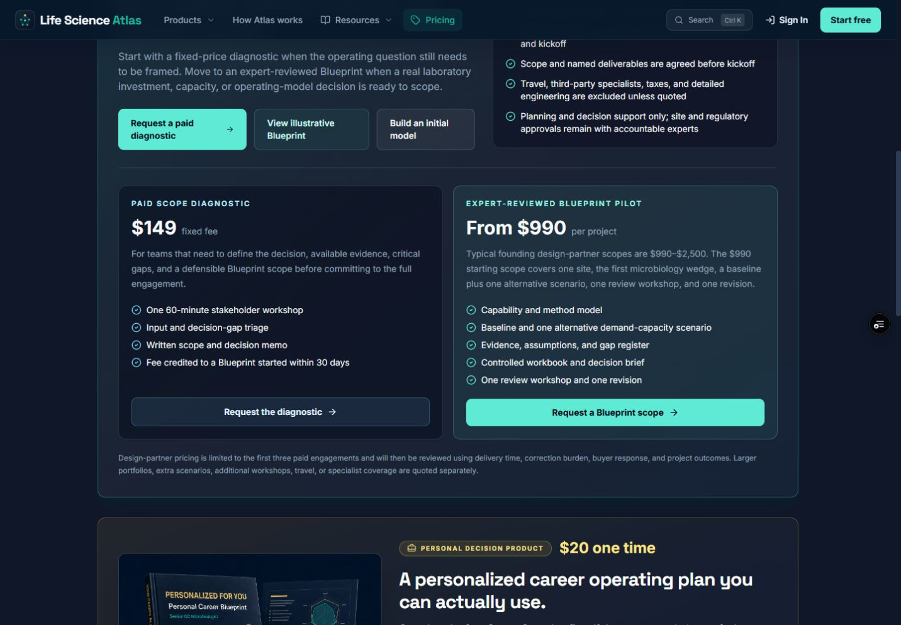
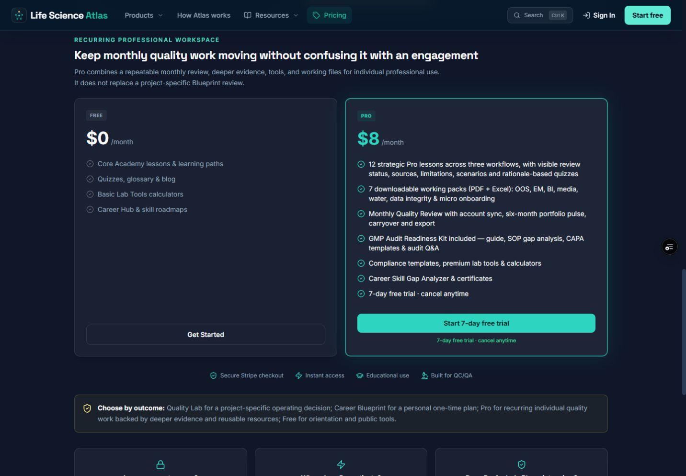
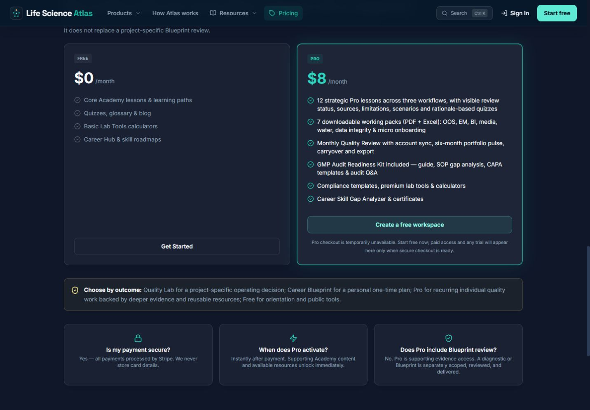
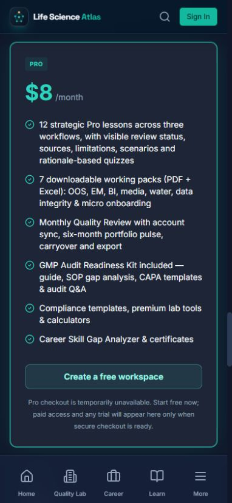

# Pricing commerce-readiness UX audit — 2026-08-25

## Scope and health

Audited the deployed Pricing journey from project-offer selection through the recurring Pro offer, then verified the corrected unavailable-checkout state locally at desktop and mobile viewports. No account was created, no commercial form was submitted, and no checkout or external communication was started.

The deployed billing-plan response reported `monthly: false`, `annual: false`, `scopeDiagnostic: false`, `careerBlueprint: false`, and `trialDays: 7`. The UI still presented an active seven-day-trial CTA, so the visible promise did not match the server's fail-closed commerce state.

## Numbered flow

1. Compare paid project offers

   

   **Health:** Good. Diagnostic and Blueprint Pilot are separated by decision maturity, scope, deliverables, and price. The Blueprint CTA was followed in the deployed preview and correctly opened the Blueprint Pilot state; the short `offer=blueprint` query value is intentionally normalized by the review route.

2. Reach the recurring Pro offer — deployed baseline

   

   **Health:** Needs correction. The page promised “Start 7-day free trial,” repeated the trial in the feature list, and displayed secure-checkout/instant-access reassurance even though neither Pro checkout plan was available. A guest would be sent through account creation before discovering the dead end.

3. Reopen the fail-closed state — corrected desktop

   

   **Health:** Good. Trial copy and payment reassurance are now conditional on an actually available Pro plan. When checkout is unavailable, the card offers a free workspace and explains that paid access and any trial appear only after secure checkout is ready.

4. Verify the corrected mobile state

   

   **Health:** Good. The primary alternative action and availability explanation remain visible and readable at 390 × 844. The same state passes the dedicated 320 px reflow check without document-level horizontal overflow.

## Strengths retained

- Product pricing remains visible without implying that a transaction can start now.
- The paid-offer value proposition is preserved while the call to action follows server-authoritative availability.
- An authenticated deep link that attempts to resume an unavailable Pro checkout now clears the stale checkout intent without calling Stripe.
- When checkout is available, the selected plan, trial message, authentication return path, and normal CTA remain unchanged.

## Accessibility and evidence limits

- Automated WCAG 2.1 A/AA checks pass for Pricing in its current fail-closed state.
- The unavailable state exposes a normal labelled link instead of an enabled control that cannot complete its task.
- Automated checks also confirm mobile reflow and absence of the unavailable trial claim.
- Screenshot and automation evidence do not establish full screen-reader clarity, high-contrast behavior, browser autofill behavior, authenticated payment completion, webhook fulfillment, or post-payment entitlement.
- Live payment acceptance remains outside this audit because it requires owner-controlled Stripe, runtime schema, email, origin, and production-readiness changes.
