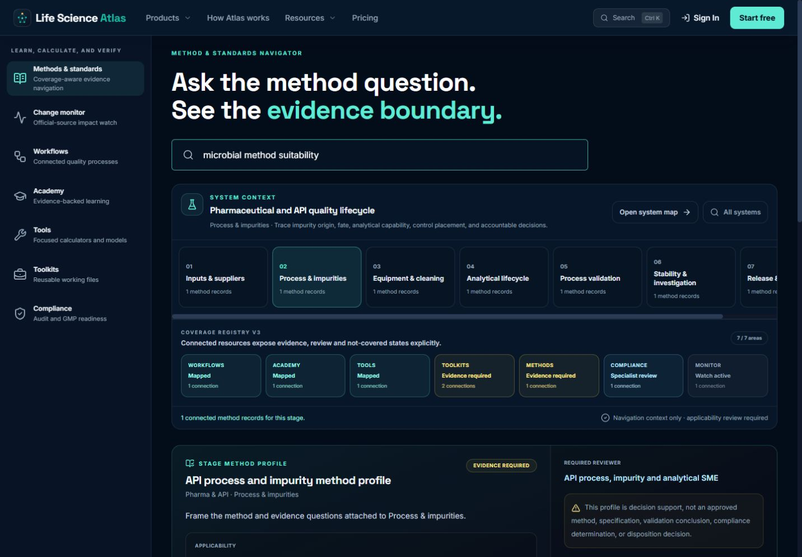
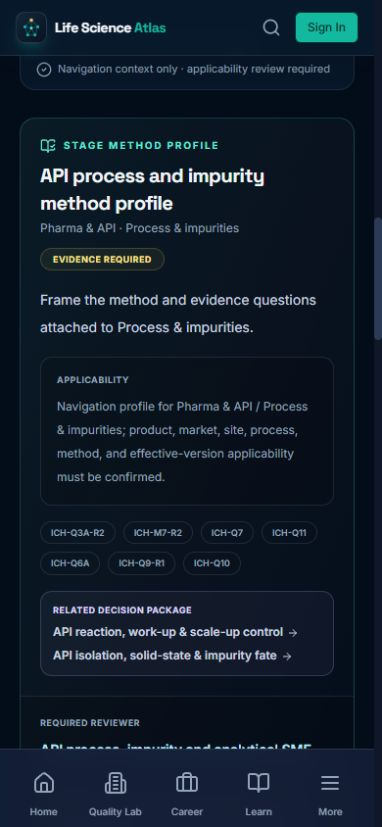

# Resource coverage UX audit — 25 August 2026

## Audit scope

Follow-up inspection of the connected Resource path that failed during the full E2E gate:

`Workflows / Pharma & API / Process & impurities → Methods → Compliance`

The corrected Methods state was inspected locally in Chrome at 1440 × 1000 and 390 × 844 CSS pixels. No external source, form, or account action was opened.

## Numbered flow

1. **Connected Methods on desktop — fixed.** The persistent Resource rail, selected system/stage, seven-area coverage registry, evidence-required method profile, applicability boundary, named source IDs, related decision packages, and reviewer role now appear together.

   

2. **Connected Methods on mobile — healthy after fix.** The stage profile reflows to one column, keeps its evidence-required status and limitations visible, and shows no document-level horizontal overflow. The mobile Resource rail and bottom product navigation remain available.

   

## Resolved findings

1. **High — the Methods destination dropped its connected stage profile.** The URL retained `system=pharma-api&stage=api-process`, but the page rendered only the generic microbiology navigator. Methods now includes the same connected system navigator and stage coverage profile used by Compliance and Monitor.
2. **High — the Resource rail was suppressed on Methods.** The global layout explicitly excluded `/methods`, so users could not continue the seven-area journey. Methods now participates in the shared Resource layout.
3. **Medium — query-bearing Resource URLs could fail location matching.** Resource path checks now normalize away query strings and fragments before deciding whether to render or activate the rail.
4. **Medium — the generic catalog could be mistaken for stage-specific coverage.** A visible “Stage profile only” note now explains that the connected card scopes the selected stage while the catalog remains cross-system and does not imply a site-approved method.

## Strengths

- Coverage and limitations use the same visual language across Workflows, Methods, Compliance, and Monitor.
- Evidence-required and specialist-review states remain visible rather than being promoted as complete coverage.
- Desktop uses the persistent rail efficiently; mobile keeps the profile readable without compressing the evidence boundary.

## Accessibility evidence and limits

- Confirmed from rendered DOM and screenshots: labeled Resource navigation, labeled stage-profile region, semantic heading hierarchy, named links/buttons, and no document-level overflow at 390 CSS pixels.
- The existing E2E journey now passes through Methods and Compliance with the selected system/stage intact.
- Not claimed: formal WCAG conformance, full keyboard/screen-reader review of the horizontally scrollable stage selector, or scientific/regulatory approval of the stage profile.

